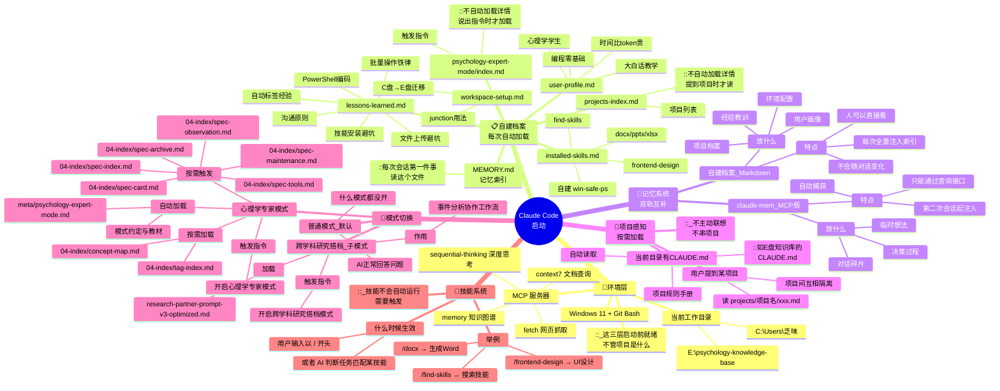

# Claude Code 启动工作流 · 思维导图

> 在 Obsidian 中打开此文件，切换到阅读模式即可看到渲染后的思维导图。
> 下面的文字版结构与 Mermaid 内容一致，双保险。



---

## 文字版启动链（从上到下）

```
Claude Code 启动
│
├── 📌 环境层（启动前就绪，和项目无关）
│   ├── Windows 11 + Git Bash
│   ├── 当前工作目录
│   └── MCP 服务器（context7 / fetch / memory / sequential-thinking）
│
├── 📋 自建档案（每次会话自动全量注入）
│   ├── MEMORY.md           ← 第一站，记忆索引
│   ├── user-profile.md     ← 你是谁
│   ├── installed-skills.md ← 装了什么技能
│   ├── lessons-learned.md  ← 踩过的坑
│   ├── workspace-setup.md  ← 盘符规划
│   ├── projects-index.md   ← 项目列表（只读索引，不读详情）
│   └── psychology-expert-mode/index.md ← 模式入口（只读索引，不读详情）
│
├── 🧠 记忆系统（双轨同时运行）
│   ├── 自建档案（Markdown）→ 手动整理，稳定事实
│   └── claude-mem（MCP版）→ 自动捕获，对话碎片
│
├── 📂 项目感知（按需，不自动）
│   ├── 当前目录有 CLAUDE.md → 自动读（如在知识库目录时）
│   └── 用户提到某项目 → 读 projects/项目名/xxx.md
│
├── 🎯 模式（用户说指令才切换）
│   ├── 默认：普通模式
│   ├── "开启心理学专家模式" → 加载知识库规范 + 概念图
│   └── "开启跨学科研究搭档模式" → 加载事件分析工作流
│
└── 🔧 技能（/ 触发或 AI 判断）
    ├── /find-skills
    ├── /frontend-design
    ├── /docx / pptx / xlsx
    └── 自建：win-safe-ps
```
