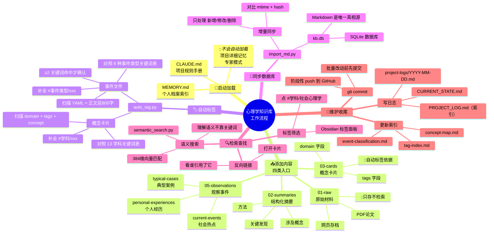

# 心理学知识库 · 完整工作流程



---

## 文字版流程（从上到下）

```
🚀 启动
   ├── 读 CLAUDE.md（项目规则）
   └── 读 MEMORY.md（个人档案）

📥 加内容（选一个入口）
   ├── 原始材料   → 01-raw/
   ├── 结构化摘要  → 02-summaries/
   ├── 概念卡片   → 03-cards/（必须写 domain + tags）
   └── 事件观察   → 05-observations/（三选一子目录）

🏷️ 自动标签
   └── python tools/auto_tag.py --apply
       ├── 概念卡 → 补 #学科/xxx
       └── 事件   → 补 #事件类型/xxx

💾 同步数据库
   └── python tools/import_md.py
       └── 增量同步到 kb.db

🔍 现在可用了
   ├── Obsidian 标签面板筛选
   ├── 反向链接追溯
   └── 语义搜索

🔧 收尾
   ├── 更新索引文件
   ├── 写项目日志
   └── git commit
```
